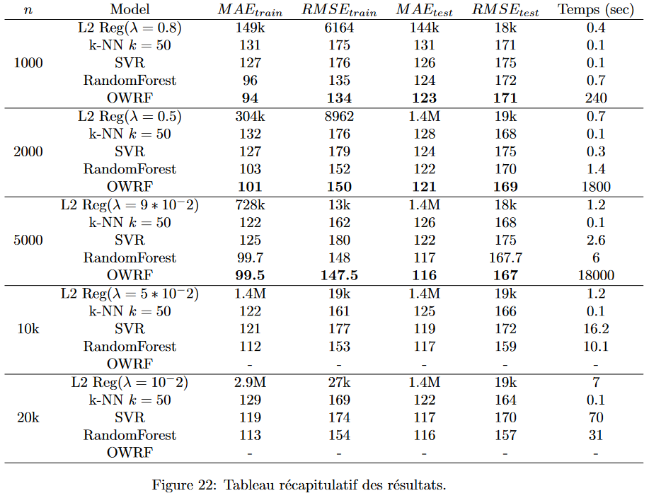

# optimal-weighted-random-forest

This repository contains the implementation of Optimal Weighted Random Forest (OWRF) based on the method described here :

@inproceedings{chen2023optimalweightedrandomforests,
      title={Optimal Weighted Random Forests}, 
      author={Xinyu Chen and Dalei Yu and Xinyu Zhang},
      year={2023},
      eprint={2305.10042},
      archivePrefix={arXiv},
      primaryClass={stat.ML},
      url={https://arxiv.org/abs/2305.10042}, 
}


The repository includes two versions of the code: one optimized for large-scale data processing using Apache Spark (we didn't try this version du to the non-availability of Spark), and another for smaller datasets without Spark (it's possible to go until 100 trees and 5000 data points).



The repository also includes a comparison table of results, demonstrating that the OWRF are slightly better than standard random forest techniques.

## How to use it ?

### Clone this repository
```bash
git clone https://github.com/HugoCvlt/opt-weighted-random-forest.git
```

### Install requirement
```bash
pip install -r requirements.txt
```

### Exemple

```python
  X_train = pd.read_csv(your_path)
  y_train = pd.read_csv(your_path)
  
  X_val = pd.read_csv(your_path)
  y_val =pd.read_csv(your_path)
  
  Mn = 100
  n=len(X_train)
  n_min = round(np.sqrt(n))
  
  owrf = Opt_WRF(X_train, y_train, Mn=Mn, n_min=n_min)
  
  owrf.two_steps_WRF_opt(verbose=True)
  rf_mae, opt_mae, rf_rmse, opt_rmse = owrf.validate(X_val, y_val)

  print("Random Forest MAE val :", np.array(rf_mae))
  print("Optimal WRF MAE val : ", np.array(opt_mae))
  print("Random Forest RMSE val :", np.array(rf_rmse))
  print("Optimal WRF RMSE val : ", np.array(opt_rmse))
```
